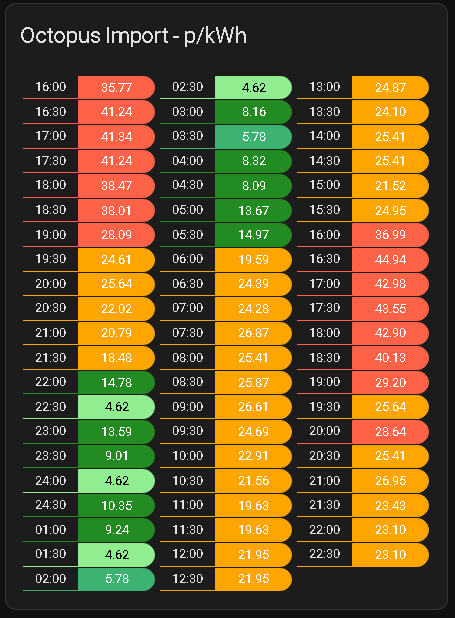
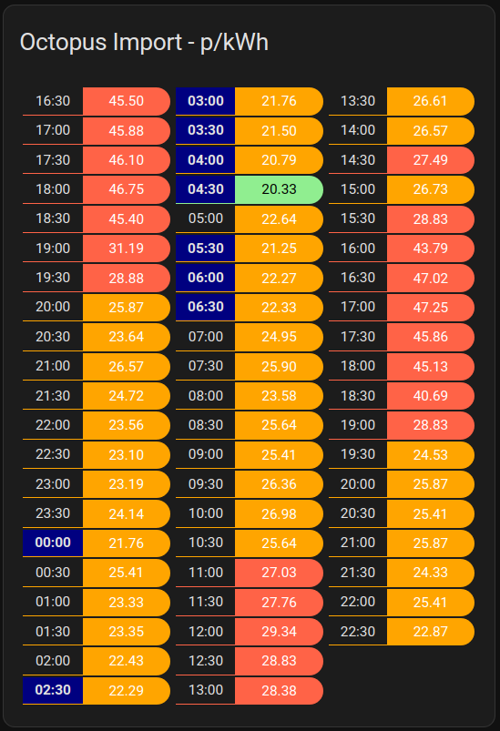

# Lovelace custom card for Octopus Energy Rate display

[](https://github.com/hacs/integration)

This lovelace card displays the Octopus Energy rate prices per each 30 minute slot, pulling the data from sensors of the the excellent [BottlecapDave/HomeAssistant-OctopusEnergy](https://github.com/BottlecapDave/) integration.

This provides a convenient, at a glance way to observe the prices on tariffs that change their price every 30 minutes, for example Octopus Agile.

#### Installation
##### HACS
The easiest way to install it is via [HACS (Home Assistant Community Store)](https://github.com/hacs/frontend). This will ensure you get updates automatically too. 

Simply click this button to go directly to the details page:

[](https://my.home-assistant.io/redirect/hacs_repository/?owner=lozzd&repository=octopus-energy-rates-card&category=plugin)

In the Home Assistant UI:
* Use HACS -> Frontend -> Top Right Menu -> Custom repositories
* Enter a repo of `lozzd/octopus-energy-rates-card` and category of "Lovelace", and click the Add button
* Click "Explore & Download Repositories" and start searching for "octo" and you should see the entry
* Click "Download" in the bottom right

This should automatically configure all the resources, so you can now skip to **Configuration**.

##### Manually
You can also install manually by downloading/copying the Javascript file in to `$homeassistant_config_dir/www/community/` and then add the Javascript file to Lovelace in the Home Assistant UI by using
Settings -> Dashboards -> Top Right Menu -> Resources

#### Configuration
Add the card to your dashboard using **Add Card -> Custom: Octopus Energy Rates Card**.

You'll need to then configure the yaml yourself - the `type` part is filled out for you. 


The only **required** key is the name of the entity sensor that contains the rates. At least one of the "current", "previous" or "next" day rate entities will need to be selected. 

As of version 9.0.0 of the Octopus Energy integration, these entities are now called `events` and not enabled by default. In the Octopus Integration settings, filter by disabled entities and then search for the last section (e.g. `current_day_rates`) then press the button to enable the entity. It may take up to an hour for the data to be present, so don't panic if the card doesn't work immediately.

The easiest way to find that entity name is by opening the Search within Home Assistant: search for `current_rate` -> click the chosen result -> choose the Settings tab -> copy `Entity ID`.

(The format is, for example: `event.octopus_energy_electricity_{METER_SERIAL_NUMBER}}_{{MPAN_NUMBER}}_current_day_rates`)

Here's an example yaml configuration - obviously replacing `<your_id_here>` with your data from above.

```
type: custom:octopus-energy-rates-card
currentEntity: event.octopus_energy_electricity_<your_id_here>_current_day_rates
cols: 2
hour12: false
showday: true
showpast: false
title: Octopus Import
unitstr: p
lowlimit: 15
mediumlimit: 20
highlimit: 30
roundUnits: 2
cheapest: true
multiplier: 100

```
and here is one for export rates:
```
type: custom:octopus-energy-rates-card
pastEntity: event.octopus_energy_electricity_<your_id_here>_export_previous_day_rates
currentEntity: event.octopus_energy_electricity_<your_id_here>_export_current_day_rates
futureEntity: event.octopus_energy_electricity_22l4132637_<your_id_here>_export_next_day_rates
cols: 3
hour12: false
showday: false
showpast: false
title: Octopus Export
unitstr: p
lowlimit: null
mediumlimit: 10
highlimit: 19
roundUnits: 2
cheapest: true
multiplier: 100
exportrates: true
```

Here's a breakdown of all the available configuration items:

| Name          | Optional | Default       | Description                                                                                                                                          |
|---------------|----------|---------------|:-----------------------------------------------------------------------------------------------------------------------------------------------------|
| currentEntity | N        | N/A           | Name of the sensor that contains the current rates you want to render, generated from the `HomeAssistant-OctopusEnergy` integration                  |
| pastEntity    | Y        | N/A           | Name of the sensor that contains the past rates you want to render, generated from the `HomeAssistant-OctopusEnergy` integration                     |
| futureEntity  | Y        | N/A           | Name of the sensor that contains the future rates you want to render, generated from the `HomeAssistant-OctopusEnergy` integration                   |
| targetTimesEntities  | Y        | N/A           | Map with the name of the sensors that contain the Target Rate Sensor, generated from the `HomeAssistant-OctopusEnergy` integration. [More here: doc](https://github.com/BottlecapDave/HomeAssistant-OctopusEnergy/blob/develop/_docs/setup/target_rate.md)                  |
| cols          | Y        | 1             | How many columns to break the rates in to, pick the one that fits best with how wide your card is                                                    |
| showpast      | Y        | false         | Show the rates that have already happened today. Provides a simpler card when there are two days of dates to show                                    |
| showday       | Y        | false         | Shows the (short) day of the week next to the time for each rate. Helpful if it's not clear which day is which if you have a lot of rates to display |
| title         | Y        | "Agile Rates" | The title of the card in the dashboard                                                                                                               |
| lowlimit      | Y        |  5 (pence)    | If the price is above `lowlimit`, the row is marked dark green. (this option is only applicable for import rates                                     |
| mediumlimit   | Y        | 20 (pence)    | If the price is above `mediumlimit`, the row is marked yellow                                                                                        |
| highlimit     | Y        | 30 (pence)    | If the price is above `highlimit`, the row is marked red.                                                                                            |
| limitEntity   | Y        | N/A           | Name of the sensor tracking the unit rate to be used to calculate limits. e.g. average rate for the last 12 hours If this is set, MediumLimit and HighLimit are ignored|
| highLimitMultiplier   | Y  | 1.1         | Multiplication factor for Limit Entity, 1.1 = 110% of the entity value.                                                                             |
| mediumLimitMultiplier | Y  | 0.8         | Multiplication factor for Limit Entity, 0.8 = 80% of the entity value.                                                                              |
| roundUnits    | Y        | 2             | Controls how many decimal places to round the rates to                                                                                               |
| showunits     | Y        | N/A           | No longer supported. Never worked. Please set a blank string using `unitstr` (see below)                                                             |
| unitstr       | Y        | "p/kWh"       | The unit to show after the rate in the table. Set to an empty string for none.                                                                       |
| exportrates   | Y        | false         | Reverses the colours for use when showing export rates instead of import                                                                             |
| hour12        | Y        | true          | Show the times in 12 hour format if `true`, and 24 hour format if `false`                                                                            |
| cheapest      | Y        | false         | If true show the cheapest rate in light green / light blue                                                                                           |
| combinerate   | Y        | false         | If true combine rows where the rate is the same price, useful if you have a daily tracker tarrif for instance                                        |
| multiplier    | Y        | 100           | multiple rate values for pence (100) or pounds (1)                                                                                                   |
| rateListLimit      | Y        | N/A           | Limit number of rates to display, useful if you only want to only show next 4 rates                                                             |
| cardRefreshIntervalSeconds | Y | 60      | How often the card should refresh to avoid using lots of CPU, defaults to once a minute                                                              |

#### A note on colouring

* The card is hardcoded to display plunge pricing (e.g, below 0p/kWh) as blue. 
* If the price is above `highLimit`, then the row is in red
* If the price is above `mediumLimit`, then the row is coloured orange
* if the price is above `lowLimit`, then the row is coloured dark green
* if the price is below `lowLimit`, then the row is coloured green
* These are reversed if `exportrates` is set to `true` (export rates have only 3 colours, red, orange and green)
* Cheapest rate is coloured in light green (above 0) / light blue (below 0)
* If targetTimesEntities is included in the config, the target hours will be highlighted in Navy by default (can be changed via the config)

#### Screenshots



##### Advanced Configurations

Import rates with the Target Rates and future rates entities specified:
```
type: custom:octopus-energy-rates-card
currentEntity: event.octopus_energy_electricity_22l4132637_1900026354329_current_day_rates
futureEntity: event.octopus_energy_electricity_22l4132637_1900026354329_next_day_rates
targetTimesEntities:
  binary_sensor.octopus_energy_target_intermittent_best_charging_rates:
cols: 3
hour12: false
showday: false
showpast: false
title: Octopus Import - p/kWh
unitstr: ''
lowlimit: 6
mediumlimit: 15
highlimit: 27
cheapest: true
multiplier: 100
```


Here is an example on how you can make use of the `targetTimesEntities` property to highlight the target hours in the card.
```
type: custom:octopus-energy-rates-card
pastEntity: event.octopus_energy_electricity_22l4132637_1900026354329_previous_day_rates
futureEntity: event.octopus_energy_electricity_22l4132637_1900026354329_next_day_rates
currentEntity: event.octopus_energy_electricity_22l4132637_1900026354329_current_day_rates
cols: 2
showday: true
showpast: false
lowlimit: 20
mediumlimit: 20
highlimit: 30
roundUnits: 2
unitstr: p/kWh
hour12: true
cheapest: false
multiplier: 100
exportrates: false
targetTimesEntities:
  binary_sensor.octopus_energy_target_intermittent_best_2h_rates:
    backgroundColour: orange
    prefix: ♨️
  binary_sensor.octopus_energy_target_intermittent_best_charging_rates:
    backgroundColour: navy
    prefix: 💧
```

Each entity contains the following optional properties with their default values:
```
backgroundColour: navy
prefix:
```

For all possible `backgroundColour` combinations, please have a look at the [valid HTML color names](https://www.w3schools.com/colors/colors_names.asp).

If you're interested to find emojis for `prefix`, you might find it the easiest to look at [Emojipedia](https://emojipedia.org/).

You can see how the above configuration looks like in the screenshot below:


#### Thanks/inspiration
This card was based on and reworked from the code [markgdev/home-assistant_OctopusAgile](https://github.com/markgdev/home-assistant_OctopusAgile/tree/master/custom_cards) which is no longer maintained. 
